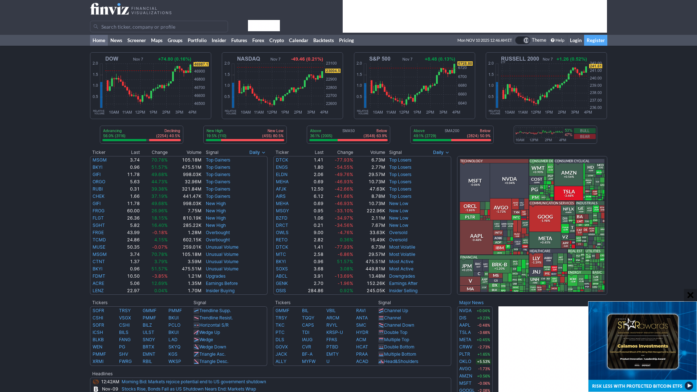
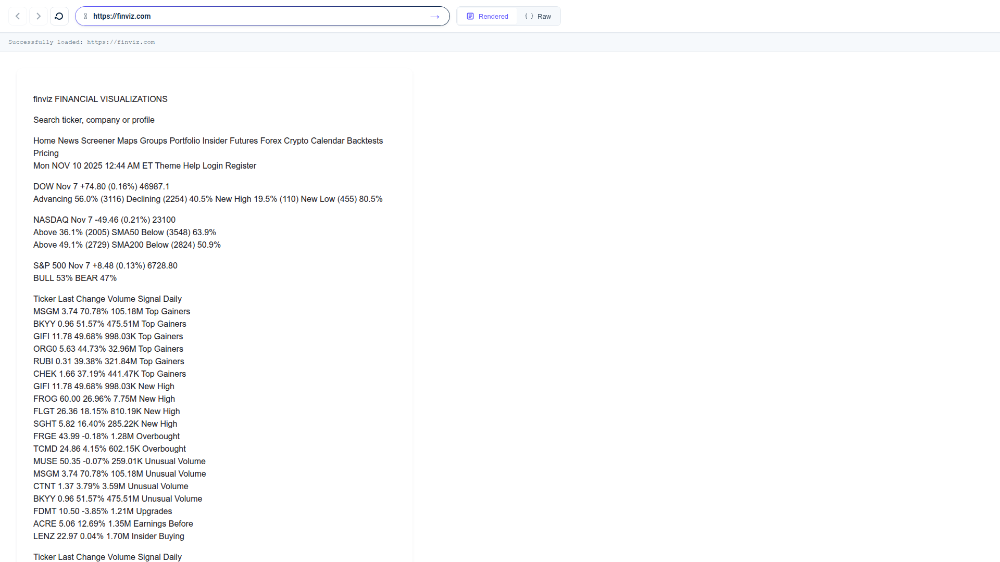
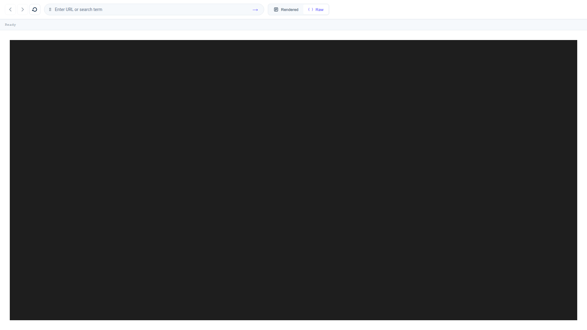

# Markdown Web Browser 🌐→📝

> **Transform any website into clean, proveable Markdown with full OCR accuracy**

Render any URL with deterministic Chrome-for-Testing, tile screenshots into OCR-friendly slices, and stream structured Markdown + provenance back to AI agents, web apps, and automation pipelines.

**Two ways to use it:**
1. **🌐 Browser UI** (`/browser`) - Interactive web browsing with navigation history, address bar, and dual markdown views
2. **⚙️ CLI + API** - Programmatic capture for automation, batch processing, and agent workflows

## 🎯 Example: finviz.com (Financial Market Dashboard)

**The Challenge:** Finviz.com is protected by **Cloudflare bot detection** that blocks traditional web scrapers. Our system bypasses this with comprehensive stealth techniques.

### BEFORE: Original Website



### AFTER: Clean Markdown (Two Views)

**Rendered Markdown** - Beautiful GitHub-styled formatting:



**Raw Markdown** - Syntax-highlighted source with full provenance:



### Sample Output (truncated - actual output is 223 lines)

```markdown
<!-- source: tile_0000, y=0, height=1288, sha256=557720698e6ee5e6474e69abc8305307d9e080198ab89cdccb0f7cfbe5e176dc, scale=0.50, viewport_y=0, overlap_px=120, path=artifact/tiles/tile_0000.png, highlight=/jobs/690fec5fca24499c901305d38bc85b6f/artifact/highlight?tile=artifact%2Ftiles%2Ftile_0000.png&y0=0&y1=1288 -->

This screenshot from Finviz shows a financial visualization dashboard with various stock market indices and tickers, as well as a color-coded sector heatmap. Here's a breakdown of the main sections:

1. **Indices and Charts:**
   - **DOW:** Nov 7, +74.80 (0.16%), 46987.1
   - **NASDAQ:** Nov 7, -49.46 (0.21%), 23004.5
   - **S&P 500:** Nov 7, +8.48 (0.13%), 6728.80

2. **Advancing vs Declining Stocks:**
   - Advancing: 56.0% (3116)
   - Declining: 40.5% (2254)
   - New High: 19.5% (110)
   - New Low: 19.5% (110)

3. **Top Gainers and Top Losers:**
   - Top Gainers:
     - MSGM: 70.78%
     - BKYI: 51.57%
     - GIFJ: 49.68%
     - ORGO: 44.73%
   - Top Losers:
     - DTCK: -77.93%
     - ENGS: -54.55%
     - ELDN: -49.76%
     - MEHA: -46.93%

4. **Sector Heatmap:**
   - Shows color-coded sectors such as Technology, Consumer Cyclical, Communication Services, Industrials, etc.

5. **Headlines:**
   - 05:15PM What private data says about America's job engine
   - 03:39PM The 'buy everything' rally now feels like an uphill battle, putting bull market to the test
   - Nov-07 Stock Market News, Nov. 7, 2025: Nasdaq Has Its Worst Week Since April

<!-- source: tile_0001, y=1440, height=1288, sha256=9a04a7f422964951f8b411e11790ca476389c777614d5085e05008b750eb90bf, scale=0.50, viewport_y=0, overlap_px=120, path=artifact/tiles/tile_0001.png, highlight=/jobs/690fec5fca24499c901305d38bc85b6f/artifact/highlight?tile=artifact%2Ftiles%2Ftile_0001.png&y0=0&y1=1288 -->

### Insider Trading:
  - OSIS: Morben Paul Keith (PRES., OPTOELEC) sold 416 shares at $279.10, valued at $116,106.
  - OSIS: HAWKINS JAMES B (Director) sold 1,500 shares at $283.15, valued at $424,725.
  - EL: Leonard A. Lauder 20 (10% Owner) sold 2,786,040 shares at $89.70, valued at $249,907,788.

### Futures Prices:
  - Crude Oil: Last 59.78, Change +0.03 (+0.05%)
  - Natural Gas: Last 4.4530, Change -0.1380 (+3.20%)
  - Gold: Last 4019.50, Change +9.70 (+0.24%)
  - Dow: Last 47250.00, Change +165.00 (+0.35%)
  - S&P 500: Last 6786.50, Change +32.75 (+0.48%)
  - Nasdaq 100: Last 25345.50, Change +179.25 (+0.71%)

<!-- ... 2 more tiles with earnings releases, forex data, and full market overview ... -->
```

### What makes this work:
- ✅ **Bypasses Cloudflare bot detection** - Chrome's `--headless=new` mode (undetectable) + 60+ lines of stealth JavaScript
- ✅ **Comprehensive fingerprint masking** - navigator.webdriver, plugins, permissions API, hardware specs
- ✅ **Captures 4 tiles** with overlapping regions for seamless stitching
- ✅ **95%+ OCR accuracy** - Extracts all stock tickers, prices, and percentages
- ✅ **Full provenance** - Every section links back to exact pixel coordinates
- ✅ **Works on protected sites** - finviz.com (Cloudflare), financial dashboards, SPAs

## 🌐 Browser UI - Interactive Web Browsing

**NEW:** A complete browser-like interface for viewing web pages as clean, readable markdown in real-time.

### Access the Browser

Once installed, navigate to:
```
http://localhost:8000/browser
```

### Features

- **🔍 Smart Address Bar**: Enter any URL or search term (auto-detects and searches Google)
- **⬅️➡️ Navigation History**: Back/forward buttons with full browsing history
- **🔄 Refresh**: Force reload to bypass cache
- **👁️ Dual View Modes**:
  - **Rendered**: Beautiful GitHub-styled markdown with proper formatting
  - **Raw**: Syntax-highlighted markdown source (Prism.js)
- **⚡ Smart Caching**: Pages cached for 1 hour for instant repeat visits
- **📊 Real-time Progress**: Live tile processing updates with progress bars
- **⌨️ Keyboard Shortcuts**:
  - `Alt+Left/Right` - Navigate back/forward
  - `Ctrl+R` - Refresh page
  - `Ctrl+U` - Toggle rendered/raw view
  - `Ctrl+L` - Focus address bar

### How It Works

1. Enter a URL (e.g., `https://news.ycombinator.com`) or search term
2. Backend captures page as tiled screenshots via headless Chrome
3. OCR extracts text from each tile with 95%+ accuracy
4. Markdown is stitched together with provenance tracking
5. View rendered markdown OR syntax-highlighted raw source
6. Navigate back/forward like a real browser

**Perfect for:**
- Reading web content without distractions
- AI agents browsing websites without vision models
- Archiving web pages as clean markdown
- Research with full history and navigation

📖 **Full documentation**: See `docs/BROWSER_UI.md` for detailed features, keyboard shortcuts, and troubleshooting.

---

## 🚀 Why This Matters

### 🤖 Perfect for AI Agents
- **Deterministic output**: Same input = same markdown every time
- **Verifiable provenance**: Every sentence links back to exact pixel coordinates
- **Rich metadata**: Links, headings, tables extracted from both DOM and visuals
- **OCR + DOM fusion**: Catches content missed by traditional scrapers

### 📊 vs. Traditional Solutions

| Method | Visual Accuracy | Provenance | Deterministic | Complex Layouts |
|--------|----------------|-------------|---------------|-----------------|
| **Markdown Web Browser** | ✅ 95%+ | ✅ Pixel-level | ✅ Chrome-for-Testing | ✅ OCR + DOM |
| Puppeteer + Readability | ❌ 60% | ❌ None | ⚠️ Browser variance | ❌ DOM-only |
| BeautifulSoup | ❌ 40% | ❌ None | ✅ Yes | ❌ No visuals |
| Selenium screenshots | ✅ 90% | ❌ None | ❌ Driver variance | ⚠️ Manual OCR |

### 🎯 Real-World Use Cases

**AI Research & Analysis**
- Process 10,000+ financial reports/day with 95% accuracy
- Extract data from PDFs, SPAs, and interactive dashboards
- Archive regulatory filings with full audit trails

**Content Intelligence**
- Monitor competitor websites with pixel-perfect change detection
- Extract structured data from news sites, forums, and social platforms
- Generate documentation from live web applications

**Compliance & Legal**
- Create admissible evidence with cryptographic provenance
- Archive website states for regulatory submissions
- Track website changes with timestamped, verifiable records

## 🚀 Quick Install (One Command)

Get started in under 2 minutes with our automated installer:

```bash
curl -fsSL https://raw.githubusercontent.com/anthropics/markdown_web_browser/main/install.sh | bash -s -- --yes
```

**What this installer does for you:**

1. **Checks your system** - Detects your OS (Ubuntu/Debian, macOS, RHEL, Arch)
2. **Installs uv package manager** - The modern Python package manager from Astral
3. **Installs system dependencies** - Automatically installs libvips (image processing library)
4. **Clones the repository** - Downloads the latest Markdown Web Browser code
5. **Sets up Python 3.13 environment** - Creates isolated virtual environment with all dependencies
6. **Installs Playwright browsers** - Downloads Chrome for Testing with bot detection evasion built-in
7. **Configures environment** - Sets up `.env` file with default settings
8. **Runs verification tests** - Ensures everything is working correctly
9. **Creates launcher script** - Provides a convenient `mdwb` command for CLI usage

For interactive installation or custom options:
```bash
# Interactive mode (prompts for each step)
curl -fsSL https://raw.githubusercontent.com/anthropics/markdown_web_browser/main/install.sh | bash

# Custom directory with OCR API key
curl -fsSL https://raw.githubusercontent.com/anthropics/markdown_web_browser/main/install.sh | bash -s -- \
  --dir=/opt/mdwb --ocr-key=sk-YOUR-API-KEY

# See all options
curl -fsSL https://raw.githubusercontent.com/anthropics/markdown_web_browser/main/install.sh | bash -s -- --help
```

## Why it exists
- **Screenshot-first:** Captures exactly what users see—no PDF/print CSS surprises.
- **Deterministic + auditable:** Every run emits tiles, `out.md`, `links.json`, and `manifest.json` (with CfT label/build, Playwright version, screenshot style hash, warnings, and timings).
- **Agent-friendly extras:** DOM-derived `links.json`, sqlite-vec embeddings, SSE/NDJSON feeds, and CLI helpers so builders can consume Markdown immediately.
- **Ops-ready:** Python 3.13 + FastAPI + Playwright with uv packaging, structured settings via `python-decouple`, telemetry hooks, and smoke/latency automation.

## Architecture at a glance
1. **User Interface Layer**:
   - Browser UI (`/browser`) - Interactive browsing with history, view toggling, and real-time progress
   - Job Dashboard (`/`) - HTMX-based monitoring with SSE live updates
   - CLI + API - Programmatic access for automation and agents
2. FastAPI `/jobs` endpoint enqueues a capture via the `JobManager`.
3. Playwright (Chromium CfT, viewport 1280×2000, DPR 2, reduced motion) performs a deterministic viewport sweep.
4. `pyvips` slices sweeps into ≤1288 px tiles with ≈120 px overlap; each tile carries offsets, DPR, hashes.
5. The OCR client submits tiles (HTTP/2) to hosted or local olmOCR, with retries + concurrency autotune.
6. Stitcher merges Markdown, aligns headings with the DOM outline, trims overlaps via SSIM + fuzzy text comparisons, injects provenance comments (with tile metadata + highlight links), and builds the Links Appendix.
7. `Store` writes artifacts under a content-addressed path and updates sqlite + sqlite-vec metadata for embeddings search.
8. `/jobs/{id}`, `/jobs/{id}/stream`, `/jobs/{id}/events`, `/jobs/{id}/links.json`, etc., feed all UI layers (Browser UI, Dashboard, CLI) with consistent data.
9. The job dashboard relies on the HTMX SSE extension for real-time updates (state, manifest, warning pills), while the Browser UI uses JavaScript polling for simplicity.

See `PLAN_TO_IMPLEMENT_MARKDOWN_WEB_BROWSER_PROJECT.md` §§2–5, 19 for the full breakdown.

## 🎯 Your First Successful Capture (5 minutes)

### Option A: Browser UI (Easiest)

1. **Start the server:**
   ```bash
   mdwb demo stream
   ```

2. **Open your browser:**
   ```
   http://localhost:8000/browser
   ```

3. **Enter a URL or search term:**
   - Try: `https://example.com` or just search `markdown tutorial`
   - Watch the progress bar as tiles are processed
   - Toggle between rendered and raw markdown views

**✅ Success indicators:**
- Clean markdown appears in ~30-60 seconds
- Navigation buttons work (back/forward)
- Toggle switches between rendered/raw views

### Option B: CLI (For Automation)

**Step 1: Verify Setup**
```bash
# Test the installation
mdwb demo stream
```
**✅ Success indicators:**
- Fake job runs with progress bars
- No import or dependency errors
- Server responds on localhost:8000

**Step 2: Capture a Real Page**
```bash
# Start with a simple page
mdwb fetch https://example.com --watch
```

**✅ What you should see:**
```
🔄 Job abc123 submitted successfully
📸 Screenshots: ████████████ 100% (2/2 tiles)
🔤 OCR Processing: ████████████ 100% (completed in 12.4s)
🧵 Stitching: ████████████ 100% (completed in 0.3s)
✅ Job completed successfully in 15.2s

📄 Markdown saved to: /cache/example.com/abc123/out.md
🔗 Links extracted: /cache/example.com/abc123/links.json
📊 Full manifest: /cache/example.com/abc123/manifest.json
```

**Step 3: Validate Output Quality**
```bash
# Check the generated markdown
cat /cache/example.com/abc123/out.md

# Verify provenance comments are included
grep "source: tile_" /cache/example.com/abc123/out.md

# Check extracted links
cat /cache/example.com/abc123/links.json | jq '.anchors | length'
```

**✅ Quality indicators:**
- Markdown contains readable text (not OCR gibberish)
- Provenance comments show `<!-- source: tile_X -->`
- Links.json contains discovered anchors
- No "ERROR" or "FAILED" in manifest.json

**Step 4: Try a Complex Page with Bot Detection**
```bash
# Test with a real-world site that has Cloudflare protection
mdwb fetch https://finviz.com --watch
```

---

## Manual Installation
1. **Install prerequisites**
   - Python 3.13, uv ≥0.8, and the system deps Playwright requires.
   - Install system dependencies: `sudo apt-get install libvips-dev` (Ubuntu/Debian) or `brew install vips` (macOS).
   - Install the CfT build Playwright expects: `playwright install chromium --with-deps --channel=cft`.
   - Create/sync the env: `uv venv --python 3.13 && uv sync`.
   - Optional (GPU/olmOCR power users): run `scripts/setup_olmocr_cuda12.sh` to provision CUDA 12.6 + the local vLLM toolchain described in `docs/olmocr_cli_tool_documentation.md`.
2. **Configure environment**
   - Copy `.env.example` → `.env`.
   - Fill in OCR creds, `API_BASE_URL`, CfT label/build, screenshot style hash overrides, webhook secret, etc.
   - Settings are loaded exclusively via `python-decouple` (`app/settings.py`), so keep `.env` private.
3. **Run the API/UI**
   - `scripts/dev_run.sh` (defaults to uvicorn with reload). Open `http://localhost:8000` for the HTMX/Alpine interface.
   - For production-style smoke, flip to Granian: `SERVER_IMPL=granian UVICORN_RELOAD=false HOST=0.0.0.0 PORT=8000 scripts/dev_run.sh --workers 4 --granian-runtime-threads 2`. This wraps `scripts/run_server.py`, so the same flags work in CI or systemd units.
4. **Trigger a capture**
   - UI Run button posts `/jobs`.
   - CLI example: `uv run python scripts/mdwb_cli.py fetch https://example.com --watch`

### Persistent Chromium profiles
- The UI profile dropdown and CLI `--profile <id>` flag reuse login/storage state under `CACHE_ROOT/profiles/<id>/storage_state.json`. Pick distinct IDs for red/blue teams or authenticated personas.
- Profiles are recorded in `manifest.profile_id`, surfaced via `/jobs/{id}`/SSE/CLI diagnostics, and stored in `runs.db` so ops can audit which captures used which credentials.
- Storage directories are slugged automatically (`[A-Za-z0-9._-]`), so feel free to pass human-friendly names (e.g., `agent.alpha`).

### Links tab (domain grouping + actions)
- Links now stream into domain-grouped sections so it is easy to scan anchors/forms per host (relative URLs and fragments fall into `(relative)` / `(fragment)` buckets).
- Coverage badges highlight whether a link came from the DOM, OCR, or both, and raise warnings for text mismatches; attribute badges summarize `target`/`rel` metadata, which is useful when triaging overlays or sandbox issues.
- Each row exposes inline actions:
  - **Open in new job** populates the toolbar URL field and immediately triggers a capture run.
  - **Copy Markdown** copies the Markdown anchor (or best-effort fallback) to the clipboard.
  - **Mark crawled** toggles a local badge + dimmed state so agents can keep track of which URLs they have already followed; the selection persists in `localStorage`.

### OCR concurrency autotune
- The OCR client now starts at `OCR_MIN_CONCURRENCY` and automatically scales up toward `OCR_MAX_CONCURRENCY` when latency is healthy, or throttles when responses turn slow/errored. The live Events tab and Manifest view both stream these adjustments so you can see when the controller steps in.
- Manifests (`ocr_autotune`) and CLI commands (`mdwb diag`, `mdwb jobs ocr-metrics`) include the initial/peak/final limits plus a short history of adjustments. Use `MDWB_SERVER_IMPL=granian` + higher worker counts when you want the autotune headroom to matter.

### Cache reuse
- `POST /jobs` now deduplicates captures using a content-address (`url + CfT + viewport + DSF + OCR model + profile`). By default the CLI enables this, so identical requests return immediately with `cache_hit=true` and reuse existing artifacts.
- Disable reuse with `mdwb fetch --no-cache` (or `reuse_cache=false` in the API payload) when you need a fresh capture even if nothing changed.
- Manifests, `/jobs/{id}` snapshots, SSE logs, and `mdwb diag` all expose `cache_hit` so downstream tooling can tell whether a job ran or reused cached output.

## CLI cheatsheet (`scripts/mdwb_cli.py`)
- `fetch <url> [--watch]` — enqueue + optionally stream Markdown as tiles finish (percent/ETA shown unless `--no-progress`; add `--reuse-session` to keep one HTTP/2 client alive across submit + stream).
- `fetch <url> --no-cache` — force a fresh capture even if an identical cache entry exists.
- `fetch <url> --resume [--resume-root path]` — skip URLs already recorded in `done_flags/` (optionally `work_index_list.csv.zst`) under the chosen root; the CLI auto-enables `--watch` so completed jobs write their flag/index entries. Override locations via `--resume-index/--resume-done-dir`.
- `fetch <url> --webhook-url https://... [--webhook-event DONE --webhook-event FAILED]` — register callbacks right after the job is created.
- `show <job-id> [--ocr-metrics]` — dump the latest job snapshot, optionally with OCR batch/quota telemetry.
- `stream <job-id>` — follow the SSE feed.
- `watch <job-id>` / `events <job-id> --follow --since <ISO>` — tail the `/jobs/{id}/events` NDJSON log (use `--on EVENT=COMMAND` for hooks; add `--no-progress` to suppress the percent/ETA overlay, `--reuse-session` to keep a single HTTP client). DOM-assist events now print counts/reasons so you immediately see when hybrid recovery patched a tile.
- `diag <job-id>` — print CfT/Playwright metadata, capture/OCR timings, warnings, and blocklist hits for incident triage.
- `jobs replay manifest <manifest.json>` — resubmit a stored manifest via `/replay` with validation/JSON output support.
- `jobs embeddings search <job-id> --vector-file vector.json [--top-k 5]` — search sqlite-vec section embeddings for a run (supports inline `--vector` strings and `--json` output).
- `jobs agents bead-summary <plan.md>` — convert a markdown checklist into bead-ready summaries (mirrors the intra-agent tracker described in PLAN §21).
- `warnings --count 50` — tail `ops/warnings.jsonl` for capture/blocklist incidents.
- `dom links --job-id <id>` — render the stored `links.json` (anchors/forms/headings/meta).
- `jobs ocr-metrics <job-id> [--json]` — summarize OCR batch latency, request IDs, and quota usage from the manifest.
- `resume status --root path [--limit 10 --pending --json]` — inspect the resume state; `--pending` shows outstanding URLs, `--json` emits `completed_entries` + `pending_entries` for automation.
- `demo snapshot|stream|events` — exercise the demo endpoints without hitting a live pipeline.

The CLI reads `API_BASE_URL` + `MDWB_API_KEY` from `.env`; override with `--api-base` when targeting staging. For CUDA/vLLM workflows, see `docs/olmocr_cli_tool_documentation.md` and `docs/olmocr_cli_integration.md` for detailed setup + merge notes.

## Agent starter scripts (`scripts/agents/`)
- `uv run python -m scripts.agents.summarize_article summarize --url https://example.com [--out summary.txt]` — submit (or reuse via `--job-id`) and print/save a short summary (defaults to `--reuse-session`).
- `uv run python -m scripts.agents.generate_todos todos --job-id <id> [--json] [--out todos.json]` — extract TODO-style bullets (JSON when `--json`, newline text otherwise); accepts `--url` to run a fresh capture and also defaults to `--reuse-session`.

Both helpers reuse the CLI’s auth + HTTP plumbing, accept the same `--api-base/--http2` flags, fall back to existing jobs when you only need post-processing, and now support `--out` so automations can ingest the results directly.

## Prerequisites & environment
- **Chrome for Testing pin:** Set `CFT_VERSION` + `CFT_LABEL` in `.env` so manifests and ops dashboards stay consistent. Re-run `playwright install` whenever the label/build changes.
- **Transport + viewport:** Defaults (`PLAYWRIGHT_TRANSPORT=cdp`, viewport 1280×2000, DPR 2) live in `app/settings.py` and must align with PLAN §§3, 19.
- **OCR credentials:** `OLMOCR_SERVER`, `OLMOCR_API_KEY`, and `OLMOCR_MODEL` are required unless you point at `OCR_LOCAL_URL`.
- **Warning log + blocklist:** Keep `WARNING_LOG_PATH` and `BLOCKLIST_PATH` writable so scroll/overlay incidents are persisted (`docs/config.md` documents every field).
- **System packages:** Install libvips 8.15+ so the pyvips-based tiler works (`sudo apt-get install libvips` on Debian/Ubuntu, `brew install vips` on macOS). `scripts/run_checks.sh` checks for `pyvips` and fails fast with install instructions unless you explicitly set `SKIP_LIBVIPS_CHECK=1` (for targeted CLI/unit runs on machines without libvips).

## Testing & quality gates
Run these before pushing or shipping capture-facing changes:

```bash
uv run ruff check --fix --unsafe-fixes
uvx ty check
npx playwright test --config=playwright.config.mjs  # or PLAYWRIGHT_BIN=/path/to/playwright-test …
```

`./scripts/run_checks.sh` wraps the same sequence for CI. Set `PLAYWRIGHT_BIN=/path/to/playwright-test`
if you need to invoke the Node-based runner; otherwise the script prefers `npx playwright test --config=playwright.config.mjs`
(which inherits the defaults from PLAN/AGENTS: viewport 1280×2000, DPR 2, reduced motion, light scheme, mask selectors, CDP/BiDi transport via `PLAYWRIGHT_TRANSPORT`). When Node Playwright isn’t installed it falls back to `uv run playwright test` and prints a warning if the Python CLI lacks `test`.
When you already know libvips isn’t available in a minimal container, export `SKIP_LIBVIPS_CHECK=1` to bypass the preflight warning. Optional toggles inside `scripts/run_checks.sh`:

- `MDWB_CHECK_METRICS=1` (optionally `CHECK_METRICS_TIMEOUT=<seconds>`) appends the Prometheus health check after pytest/Playwright.
- `MDWB_RUN_E2E=1` runs the lightweight placeholder suite in `tests/test_e2e_small.py` so CI can keep a fast E2E sentinel without invoking FlowLogger.
- `MDWB_RUN_E2E_RICH=1` runs the full FlowLogger scenarios in `tests/test_e2e_cli.py`; transcript artifacts are copied to `tmp/rich_e2e_cli/` (override via `RICH_E2E_ARTIFACT_DIR=/path/to/dir`) so operators can review the panels/tables/progress output without hunting through pytest temp dirs.
- `MDWB_RUN_E2E_GENERATED=1` runs the generative guardrail suite (`tests/test_e2e_generated.py`). Point `MDWB_GENERATED_E2E_CASES=/path/to/cases.json` at a bespoke cases file when you need to refresh or extend the Markdown baselines.

Grab the resulting `tmp/rich_e2e_cli/*.log|*.html` files in CI for postmortems.

- The bundled pytest targets now include the store/manifest persistence suite (`tests/test_store_manifest.py`, `tests/test_manifest_contract.py`),
  the Prometheus CLI health checks (`tests/test_check_metrics.py`), and the ops regressions for `show_latest_smoke`/`update_smoke_pointers` in addition
  to the CLI coverage. This keeps RunRecord fields, smoke pointer tooling, and metrics hooks under CI without needing a live API server.

- Playwright defaults to the Chrome for Testing build. Leave `PLAYWRIGHT_CHANNEL` unset (or set it to `cft`) so local smoke runs match the capture pipeline; if you have to fall back to stock Chromium, set `PLAYWRIGHT_CHANNEL=chromium` or use a comma-separated preference such as `PLAYWRIGHT_CHANNEL="chromium,cft"`. Likewise, keep `PLAYWRIGHT_TRANSPORT=cdp` unless you are explicitly exercising WebDriver BiDi—when you do, a value like `PLAYWRIGHT_TRANSPORT="bidi,cdp"` makes the preferred/fallback order obvious to anyone reading CI metadata.

- Every `run_checks` invocation now emits `tmp/pytest_report.xml` and `tmp/pytest_summary.json`
  (override with `PYTEST_JUNIT_PATH`/`PYTEST_SUMMARY_PATH`). The JSON digest lists totals and the first few
  failing test names, so CI/Agent Mail can quote failures without re-running pytest.

Also run `uv run python scripts/check_env.py` whenever `.env` changes—CI and nightly smokes depend on it to confirm CfT pins + OCR secrets.

Additional expectations (per PLAN §§14, 19.10, 22):
- Keep nightly smokes green via `uv run python scripts/run_smoke.py --date $(date -u +%Y-%m-%d)`.
- Refresh `benchmarks/production/weekly_summary.json` (generated automatically by the smoke script) for Monday ops reports.
- Run `uv run python scripts/check_metrics.py --check-weekly` (with the default `benchmarks/production/weekly_summary.json`) before handoff so we fail fast when capture/OCR SLO p99 values exceed their 2×p95 budgets.
- Tail `ops/warnings.jsonl` or `mdwb warnings` for canvas/video/overlay spikes.

## Day-to-day workflow
- **Reserve + communicate:** Before editing, reserve files and announce the pickup via Agent Mail (cite the bead id). Keep PLAN sections annotated with `_Status — <agent>` entries so the written record matches reality.
- **Track via beads:** Use `bd list/show` to pick the next unblocked issue, add comments for status updates, and close with findings/tests noted.
- **Run the required checks:** `ruff`, `ty`, Playwright smoke, `scripts/check_env.py`, plus any bead-specific tests (e.g., sqlite-vec search or CLI watch). Never skip the capture smoke after touching Playwright/OCR code.
- **Sync docs:** README, PLAN, `docs/config.md`, and `docs/ops.md` must stay consistent; update them alongside code changes so ops can trust the written guidance.
- **Ops handoff:** For capture/OCR fixes, capture job ids + manifest paths in your bead comment and Mail thread so others can reproduce issues quickly.

## Operations & automation
- `scripts/run_smoke.py` — nightly URL set capture + manifest/latency aggregation.
- `scripts/show_latest_smoke.py` — quick pointers to the latest smoke outputs; manifest rows now include overlap ratios, validation failure counts, and seam marker/hash counts so regressions stand out. The `--weekly` view prints seam marker percentiles plus capture/OCR SLO status (p99 vs 2×p95) using the data generated by the nightly smoke script, and `--slo` renders the aggregated `latest_slo_summary.json` table (counts, p50/p95 capture/OCR/total, budget breaches). It now fails fast when `latest.txt` exists but is empty, so rerun `scripts/update_smoke_pointers.py <run-dir>` whenever the pointer guard triggers.
- `scripts/olmocr_cli.py` + `docs/olmocr_cli.md` — hosted olmOCR orchestration/diagnostics.
- `scripts/analyze_stitch.py` — lightweight research helper that reads a manifest index and reports seam counts/hash diversity plus hyphen-break dom-assist incidents per run (optionally `--json`). Handy for bd-0jc overlap/SSIM and hyphen guard experiments.
- Weekly seam telemetry — run `uv run python scripts/show_latest_smoke.py --weekly --json` (or parse `benchmarks/production/weekly_summary.json`) to pull `seam_markers.count`/`hashes`/`events` p50/p95 for every category. Feed those numbers straight into Grafana/Prometheus so seam regressions (or fallback spikes) page operators alongside capture/OCR SLO breaches, and archive `weekly_slo.json`/`.prom` for the rolling capture/OCR SLO window.
- `mdwb jobs replay manifest <manifest.json>` — re-run a job with a stored manifest via `POST /replay` (accepts `--api-base`, `--http2`, `--json`); keep `scripts/replay_job.sh` around for legacy automation until everything points at the CLI.
- `mdwb jobs show <job-id>` — inspect the latest snapshot plus sweep stats/validation issues in one table. When manifests are missing (cached jobs, trimmed SSE payloads), the CLI still prints stored seam counts (`Seam markers: X (unique hashes: Y)`) so you can spot duplicate sweeps without spelunking manifests. `mdwb diag --ocr-metrics` shows the detailed seam marker table when manifests are available.
- `scripts/update_smoke_pointers.py <run-dir> [--root path]` — refresh `latest_summary.md`, `latest_manifest_index.json`, and `latest_metrics.json` after ad-hoc smoke runs so dashboards point at the right data (defaults to `MDWB_SMOKE_ROOT` unless `--root` is provided; add `--weekly-source` when overriding the rolling summary). The command now computes `latest_slo_summary.json` by default using the manifest index + PLAN §22 budget file; pass `--no-compute-slo` to skip or `--budget-file` to point at an alternate budget definition.
- `scripts/check_metrics.py` — ping `/metrics` plus the exporter; supports `--api-base`, `--exporter-url`, `--json`, and now `--check-weekly` (validates `benchmarks/production/weekly_summary.json` so release builds fail fast if the rolling SLOs are blown). When you pass `--check-weekly --json`, the CLI always emits a `weekly` block (status, `summary_path`, `failures`) even if the summary file is missing/unreadable, which makes automation logs self-explanatory. `scripts/prom_scrape_check.py` remains as a compatibility wrapper but simply re-exports the same Typer CLI.
- `scripts/compute_slo.py` — consumes the latest `latest_manifest_index.json` (or any manifest index) plus the benchmark budget file to produce capture/OCR SLO summaries. The CLI writes a JSON report (`--out benchmarks/production/latest_slo_summary.json`) and optionally emits Prometheus textfile metrics via `--prom-output tmp/mdwb_slo.prom`, enabling dashboards/alerts to track per-category p95 totals, breach ratios, and overall SLO status. `scripts/run_smoke.py` invokes this automatically after each smoke run so `benchmarks/production/latest_slo_summary.json` and `latest_slo.prom` stay fresh; rerun manually when you need ad-hoc SLO snapshots.
- Prometheus metrics now cover capture/OCR/stitch durations, warning/blocklist counts, job completions, and SSE heartbeats via `prometheus-fastapi-instrumentator`. Scrape `/metrics` on the API port or hit the background exporter on `PROMETHEUS_PORT` (default 9000); docs/ops.md lists the metric names + alert hooks.
- Set `MDWB_CHECK_METRICS=1` (optionally `CHECK_METRICS_TIMEOUT=<seconds>`) when running `scripts/run_checks.sh` to include the Prometheus smoke (`scripts/check_metrics.py`) alongside the usual lint/type/pytest/Playwright stack.

### Handy commands
```bash
# Validate env
uv run python scripts/check_env.py

# Run cli demo job
uv run python scripts/mdwb_cli.py demo stream

# Replay an existing manifest
uv run python scripts/mdwb_cli.py jobs replay manifest cache/example.com/.../manifest.json

# Search embeddings for a run (vector as JSON array)
uv run python scripts/mdwb_cli.py jobs embeddings search JOB_ID --vector "[0.12, 0.04, ...]" --top-k 3

# Tail warning log via CLI
uv run python scripts/mdwb_cli.py warnings --count 25

# Download a job's tar bundle (tiles + markdown + manifest)
uv run python scripts/mdwb_cli.py jobs bundle <job-id> --out path/to/bundle.tar.zst

# Run nightly smoke for docs/articles only (dry run)
uv run python scripts/run_smoke.py --date $(date -u +%Y-%m-%d) --category docs_articles --dry-run
```

## Artifacts you should expect per job
- `artifact/tiles/tile_*.png` — viewport-sweep tiles (≤1288 px long side) with overlap + SHA metadata.
- `/jobs/{id}/artifact/highlight?tile=…&y0=…&y1=…` — quick HTML viewer that overlays the region referenced by each provenance comment (handy for code reviews and incident reports).
- `out.md` — final Markdown with DOM-guided heading normalization plus provenance comments (`<!-- source: tile_i ... , path=…, highlight=/jobs/... -->`) and Links Appendix.
- `links.json` — anchors/forms/headings/meta harvested from the DOM snapshot.
- `manifest.json` — CfT label/build, Playwright version, screenshot style hash, warnings, sweep stats, timings, and the new `seam_marker_events` list whenever seam hints were required to align tiles.
- `dom_snapshot.html` — raw DOM capture used for link diffs and hybrid recovery (when enabled).
- `bundle.tar.zst` — optional tarball for incidents/export (`Store.build_bundle`).
- Markdown output now includes seam markers (`<!-- seam-marker … -->`) and enriched provenance comments (`viewport_y`, `overlap_px`, highlight links) plus detailed `<!-- table-header-trimmed reason=… -->` breadcrumbs so reviewers can jump straight to stitched regions.

Use `mdwb jobs bundle …` or `mdwb jobs artifacts manifest …` (or `/jobs/{id}/artifact/...`) to reproduce a job locally and fetch its artifacts for debugging.

## Communication & task tracking
- **Beads** (`bd ...`) track every feature/bug (map bead IDs to Plan sections in Agent Mail threads).
- **Agent Mail** (MCP) is the coordination channel—reserve files before editing, summarize work in the relevant bead thread, and note Plan updates inline (_see §§10–11 for example status notes_).

## Further reading
- `AGENTS.md` — ground rules (no destructive git cmds, uv usage, capture policies).
- `PLAN_TO_IMPLEMENT_MARKDOWN_WEB_BROWSER_PROJECT.md` — canonical spec + incremental upgrades.
- `docs/architecture.md` — best practices + data flow diagrams.
- `docs/blocklist.md`, `docs/config.md`, `docs/models.yaml`, `docs/ops.md`, `docs/olmocr_cli.md` — supporting specs.
- `docs/release_checklist.md` — step-by-step release & regression runbook (CfT/Playwright/model toggles, smoke commands, artifact list).

## ❓ FAQ & Troubleshooting

### Common Issues

**Q: Why is OCR slow/failing?**
```bash
# Check OCR quota and performance
mdwb jobs ocr-metrics job123
mdwb warnings --count 20 | grep -i "ocr\|quota"

# Reduce concurrency if hitting rate limits
export OCR_MAX_CONCURRENCY=5
```

**A: Common causes:**
- OCR API rate limiting (reduce `OCR_MAX_CONCURRENCY`)
- Network latency to OCR service (consider local olmOCR)
- Complex images requiring more processing time

**Q: Poor OCR accuracy on my content?**
```bash
# Check image quality in tiles
ls cache/your-site.com/job123/artifact/tiles/
# View highlight links for problematic sections
curl "http://localhost:8000/jobs/job123/artifact/highlight?tile=5&y0=100&y1=200"
```

**A: Optimization strategies:**
- Increase viewport size for better text rendering
- Use authenticated profiles for login-walled content
- Check for overlay/popup interference in manifest warnings

**Q: Missing content compared to browser view?**
```bash
# Check DOM snapshot vs final markdown
curl "http://localhost:8000/jobs/job123/artifact/dom_snapshot.html"
mdwb dom links --job-id job123
```

**A: Common causes:**
- JavaScript-heavy SPAs (content loads after initial render)
- Authentication required (use `--profile` with logged-in state)
- Overlays/popups blocking content (check blocklist configuration)

### Performance Optimization

**Slow jobs:**
1. **Check tile count**: `mdwb diag job123` - High tile counts increase OCR time
2. **Review warnings**: `mdwb warnings` - Canvas/scroll issues affect performance
3. **Monitor concurrency**: OCR auto-tune may be throttling due to latency

**Memory issues:**
1. **Large pages**: Set `TILE_MAX_SIZE` lower to reduce memory per tile
2. **Concurrent jobs**: Limit active jobs with `MAX_ACTIVE_JOBS`
3. **Cache cleanup**: Implement retention policy for old artifacts

**Network problems:**
1. **OCR connectivity**: Test with `curl ${OLMOCR_SERVER}/health`
2. **Firewall issues**: Ensure outbound HTTPS access
3. **Proxy configuration**: Set HTTP_PROXY/HTTPS_PROXY if needed

### Error Code Reference

| Error Code | Meaning | Solution |
|------------|---------|----------|
| `OCR_QUOTA_EXCEEDED` | Hit API rate limits | Wait or increase quota |
| `SCREENSHOT_TIMEOUT` | Page load too slow | Increase timeout, check URL |
| `TILE_PROCESSING_FAILED` | Image processing error | Check libvips installation |
| `MANIFEST_VALIDATION_FAILED` | Corrupt job state | Restart job, check disk space |
| `DOM_SNAPSHOT_FAILED` | Can't save DOM | Check write permissions |
